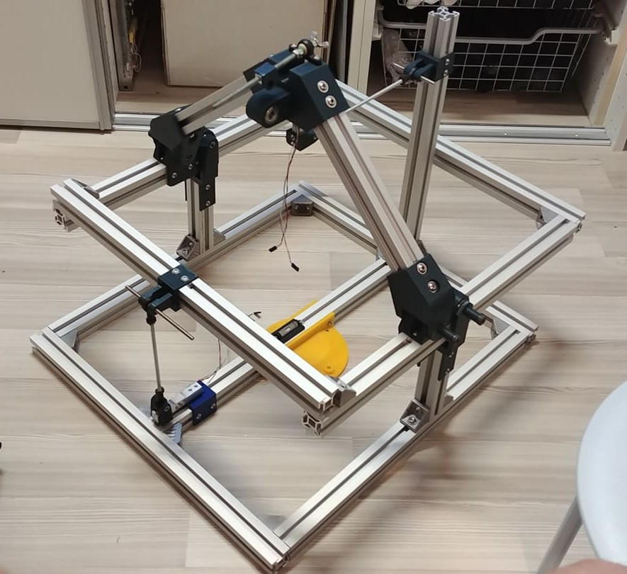

# TF-AEROSCALE
**Force balance for measuring lift and drag of aerodynamic surfaces**

Knowledge of aircraft wings is important for optimizing their flight parameters. This scale-type device is used to measure the polar of the wing or rotor. The device is designed so that it is possible to measure wings/rotors of various sizes. Because it is difficult to obtain a enought large wind tunnel, weight is designed so that it can be operated, for example, on the roof of a [TF-R1 driving car](https://github.com/ThunderFly-aerospace/TF-R1) that ensures suficiently high quality laminar flow.

## Features

* Robust construction to measure Lift and Drag forces up to 400 N.
* Open-source design (Open-source HW and SW)
* Scalability for different needs (OpenSCAD parametric design)
* Polar measurement capable (Lift and drag ratio calculation)
* Airspeed and groundspeed measurement
* RPM measurement (In case of rotor)
* Use on a car roof or in a wind tunnel

## Parameters

| Parameter | Value | Description |
|-----------|-------|-------------|
| Sensing element | strain gauges |  |
| Interface | USB | The data readout is realised by direct control of I2C devices |
| Operating and storage temperature | -20 - +40°C |  |
| Operational humidity | 0-100 % | At humidity above 80% the performance of the sensors could be degraded in case of prolonged time periods |
| Input power | USB powered | |
| Mass | 5 kg |  |
| Dimensions |  600 x 560 x 600 mm| Height x width x lenght |
| Weather resistance | IP40 | |

# Software installation

Repository use git submodules therefore an initialization of repository is needed prior make.

    git submodule init
    git submodule update

After that commands the make should be run from src directory.

    force_balance/cad/src$ make -j 4

## Electrical connection

